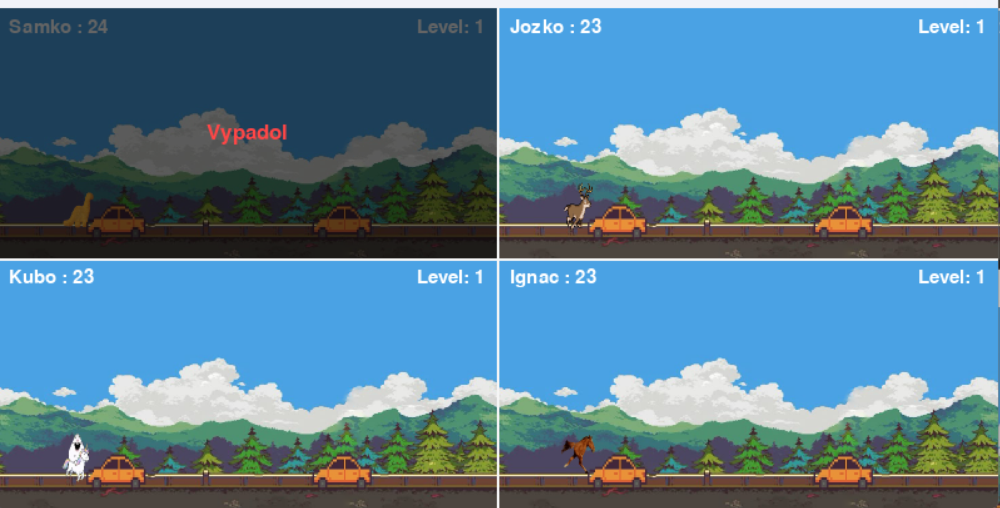
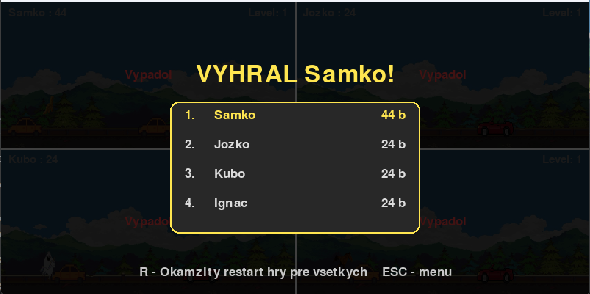

# DEERUN

**DEERUN** je 2D arkádová hra vytvorená v knižnici PyGame. Hráč ovláda jeleňa, preskakuje prichádzajúce vozidlá a snaží sa dosiahnuť čo najvyššie skóre.

## Ukážka hry (Singleplayer)


## Ukážka hry (Multiplayer)



## Pointa hry

Cieľom hry je prežiť čo najdlhšie v premávke a získať čo najvyššie skóre.

* Hráč ovláda postavu jeleňa.
* Hlavnou úlohou je vyhýbať sa dopravným prostriedkom.
* Hra obsahuje levely, ktoré postupne zvyšujú rýchlosť a náročnosť.
* Body sa získavajú za úspešne preskočené vozidlá.
* Po kolízii sa zobrazí obrazovka Game Over s aktuálnym skóre.
* Najlepšie výsledky sa ukladajú a zobrazujú v hlavnom menu.

## Funkcionality

### Hotové

* **Singleplayer režim** so základnou hernou slučkou.
* **Multiplayer režim (LAN)** s podporou hostiteľa a klientov.
* **OOP štruktúra** rozdelená do samostatných tried `Dino`, `Obstacle`, `Background` a `Game`.
* **Animovaná postava** s behom a skokom.
* **Rôzne typy vozidiel** s rozdielnymi rozmermi a rýchlosťami.
* **Nekonečne rolujúce pozadie**.
* **Dynamická obtiažnosť** podľa skóre a aktuálneho levelu.
* **Zvukový systém** s hudbou na pozadí a zvukovými efektmi.
* **Nastavenia hlasitosti** ukladané do súboru `settings.json`.
* **Systém najlepších skóre (Highscore)** ukladaný do súboru `highscores.json`.
* **Hlavné menu** so singleplayerom, multiplayerom, nastaveniami a zobrazením rekordov.

### Multiplayer

* Hráči sa môžu pripojiť k serveru pomocou IP adresy hostiteľa.
* Každý hráč ovláda vlastného jeleňa.
* Po kolízii môže hostiteľ iniciovať reštart hry pre všetkých hráčov.
* Komunikácia medzi klientmi a serverom je realizovaná pomocou socketov.

## Ovládanie

| Klávesa                  | Akcia                                          |
| ------------------------ | ---------------------------------------------- |
| **Medzerník (Space)**    | Skok                                           |
| **R**                    | Reštart hry                                    |
| **ESC v hre**            | Ukončenie hry alebo návrat do menu             |
| **ESC v menu**           | Návrat o úroveň späť alebo ukončenie aplikácie |

## Spustenie

### 1. Inštalácia závislostí

```bash
pip install -r requirements.txt
```

### 2. Spustenie hry

```bash
python main.py
```

## Štruktúra projektu

```plaintext
Dino_run/
├── .venv/                    # Virtuálne Python prostredie
├── assets/
│   ├── characters/           # Sprity a animácie jeleňa
│   └── images/               # Vozidlá a pozadie
├── game/
│   ├── __init__.py
│   ├── background.py         # Nekonečné rolovanie pozadia
│   ├── dino.py               # Logika hráča
│   ├── game.py               # Singleplayer herná slučka
│   ├── init.py
│   ├── multiplayer_game.py   # Multiplayer herná slučka
│   ├── network_config.py     # Sieťová konfigurácia
│   ├── obstacle.py           # Vozidlá a prekážky
│   └── paths.py              # Cesty k assetom
├── sounds/                   # Hudba a zvukové efekty
├── .gitignore
├── client.py                 # Multiplayer klient
├── highscores.json           # Uložené rekordy
├── main.py                   # Spustenie hry
├── README.md                 # Dokumentácia projektu
├── requirements.txt          # Zoznam použitých knižníc
├── server.py                 # Multiplayer server
├── settings.json             # Nastavenia hlasitosti
└── start_menu.py             # Hlavné menu
```

## Použité zdroje

### Grafické podklady

* Background: https://sk.pinterest.com/pin/108930884731084699/
* Orange car: https://sk.pinterest.com/pin/237776055322046224/
* Red car: https://sk.pinterest.com/pin/567594359321722798/
* Yellow Taxi: https://sk.pinterest.com/pin/439523244906444352/
* Green car: https://sk.pinterest.com/pin/69172544272333071/
* Truck: https://sk.pinterest.com/pin/412360909650699110/
* Blue car: https://sk.pinterest.com/pin/83246293107216356/

### Hudba a zvuky

* Pixel Drift – Uppbeat: https://uppbeat.io/track/pecan-pie/pixel-drift
* Deer Jump Effect – Freesound: https://freesound.org/people/Bastianhallo/sounds/462958/
* Collision / Crash Effect – Freesound: https://freesound.org/people/squareal/sounds/237375/
