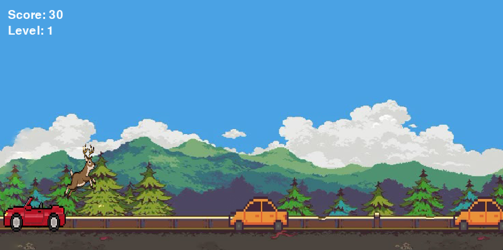

# DEERUN

**DEERUN** je 2D arkádová hra, v ktorej sa hráč vžije do role jeleňa snažiaceho sa prežiť v rušnej premávke.

## Ukážka menu
![Ukážka menu]

## Ukážka settings
![Ukážka menu]

## Ukážka top-skóre
![Ukážka top skóre]

## Ukážka hry


## Pointa hry
Cieľom hry je získať čo najvyššie skóre a vyhnúť sa zrážke.

- Hráč ovláda jeleňa.
- Hlavnou úlohou je **vyhýbať sa dopravným prostriedkom** (autá, kamióny).
- Získať čo najvyššie skóre.
- Hra sa postupom času **zrýchľuje**, čím sa zvyšuje obtiažnosť.
- Hra končí stavom *Game Over*, keď dôjde ku kolízii.

## Ovládanie

| Klávesa | Akcia |
| :--- | :--- |
| **Medzerník (Space)** | Skok (vyhnutie sa prekážke) |
| **R** | Reštart hry |
| **ESC** | Ukončenie celého programu |

## Vlastnosti hry

- **Zvuk:** Zvukové efekty s možnosťou úpravy hlasitosti pre lepší zážitok.
- **Počítanie skóre:** Sledovanie aktuálneho úspechu hráča.
- **Top 15 Tabuľka:** Systém zaznamenávania 15 najlepších dosiahnutých výsledkov.
- **Dynamická obtiažnosť:** Postupné zvyšovanie rýchlosti hry.
- **OOP:** Použitie tried a objektov v kóde.
- **Game Over stav:** Jasné ukončenie hry pri neúspechu.
- **Grafika:** Použitie farieb, textu a pixel-art štýlu.

## Použité technológie

Projekt využíva nasledujúce nástroje:

- **Jazyk:** Python 3
- **Knižnica:** PyGame
- **IDE:** PyCharm
- **Verziovanie:** GitHub

## Štruktúra projektu
```text
Dino_run/
├── assets/
│   └── images/       # Vozidla, pozadia a animácie postavy
├── game/
│   ├── background.py # Nekonečné rolovanie pozadia
│   ├── dino.py       # Logika a animácie jelena
│   ├── game.py       # Engine hry a správa stavov
│   ├── init.py
│   └── obstacle.py   # Definícia a správanie vozidiel
├── sounds/           # Hudba na pozadí a zvukové efekty
├── main.py           # Vstupný bod (spúšťač hry)
├── start_menu.py     # Úvodné menu hry
├── highscores.json   # Top skóre
├── settings.json     # Nastavenia hlasitosti
└── README.md         # Dokumentácia projektu
